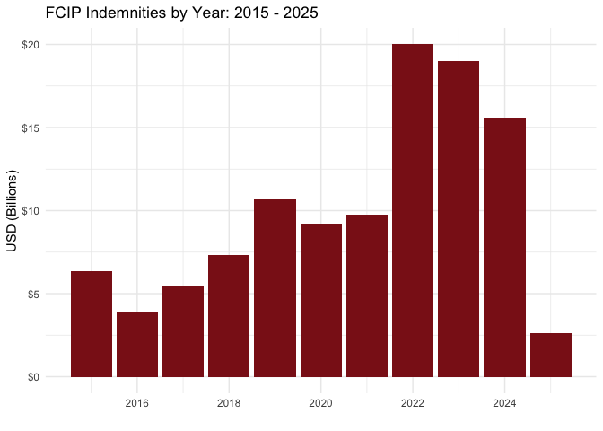

rfcip (R FCIP)
================

- <a href="#introduction" id="toc-introduction">Introduction</a>
- <a href="#installation" id="toc-installation">Installation</a>
- <a href="#supported-data-sources"
  id="toc-supported-data-sources">Supported Data Sources</a>
  - <a href="#summary-of-business" id="toc-summary-of-business">Summary of
    Business</a>
  - <a href="#cause-of-loss-files" id="toc-cause-of-loss-files">Cause of
    Loss Files</a>
  - <a href="#price" id="toc-price">Price</a>

<!-- README.md is generated from README.Rmd. Please edit that file -->

[](https://github.com/dylan-turner25/rfcip/actions/workflows/R-CMD-check.yaml)
[](https://www.repostatus.org/#active)
[](https://www.tidyverse.org/lifecycle/#stable)
[](https://codecov.io/gh/dylan-turner25/rfcip)

## Introduction

`rfcip` provides a set of tools to allow users to access publicly
available data related to the Federal Crop Insurance Program. The
package provides a set of functions to easily navigate and access data
that is publicly available, but otherwise scattered across different
urls, files, and data portals. Although no official API exists for
Federal Crop Insurance Data, much of the data can be located with a
structured url meaning the `rfcip` package effectively functions like a
defacto API wrapper.

**Disclaimer:** This product uses data provided by the USDA, but is not
endorsed by or affiliated with USDA or the Federal Government.

## Installation

`rfcip` can be installed directly from github using
`remotes::install_github("https://github.com/dylan-turner25/rfcip")`

## Supported Data Sources

### Summary of Business

The [Summary of
Business](https://www.rma.usda.gov/tools-reports/summary-of-business)
files produced by the USDA Risk Management Agency contains crop
insurance participation measures and outcomes by state, county, crop,
and insurance policy choices. Insured acres, collected premiums,
disbursed subsides, liabilities, number of policies sold, number of
indemnified policies, and loss ratios are all available from the summary
of business.

Accessing data from the summary of business can be done using the
`get_sob_data`. With no arguments specified, the `get_sob_data` function
will default to downloading data from [RMA’s summary of business report
generator](https://public-rma.fpac.usda.gov/apps/SummaryOfBusiness/ReportGenerato%22)
for the current year, at the highest level aggregation.

``` r
library(rfcip)
get_sob_data()
#> # A tibble: 10 × 21
#>    commodity_year policies_sold policies_earning_prem policies_indemnified
#>             <dbl>         <dbl>                 <dbl>                <dbl>
#>  1           2025         49958                 16750                  641
#>  2           2025       2369265                220766                 2288
#>  3           2025          2511                  2003                  373
#>  4           2025            82                    72                    0
#>  5           2025            60                    29                    0
#>  6           2025           756                   305                   59
#>  7           2025          2736                  1827                  294
#>  8           2025            16                     4                    0
#>  9           2025          7778                  6927                    0
#> 10           2025          1950                  1950                  642
#> # ℹ 17 more variables: units_earning_prem <dbl>, units_indemnified <dbl>,
#> #   quantity <dbl>, quantity_type <chr>, companion_endorsed_acres <dbl>,
#> #   liabilities <dbl>, total_prem <dbl>, subsidy <dbl>, indemnity <dbl>,
#> #   efa_prem_discount <dbl>, addnl_subsidy <dbl>, state_subsidy <dbl>,
#> #   pccp_state_matching_amount <dbl>, organic_certified_subsidy_amount <dbl>,
#> #   organic_transitional_subsidy_amount <dbl>, earn_prem_rate <dbl>,
#> #   loss_ratio <dbl>
```

Most of the arguments for the `get_sob_data` function filter the
returned data. For example, specifying the `year = 2022` and
`crop = "corn"` will return data for corn in crop year 2022. For a
description of all the arguments that can be supplied to `get_sob_data`
see the help file for the function using `help(get_sob_data)`

``` r
get_sob_data(year = 2022, crop = "corn")
#> # A tibble: 1 × 23
#>   commodity_year commodity_code commodity_name policies_sold
#>            <dbl> <chr>          <chr>                  <dbl>
#> 1           2022 0041           Corn                  590772
#> # ℹ 19 more variables: policies_earning_prem <dbl>, policies_indemnified <dbl>,
#> #   units_earning_prem <dbl>, units_indemnified <dbl>, quantity <dbl>,
#> #   quantity_type <chr>, companion_endorsed_acres <dbl>, liabilities <dbl>,
#> #   total_prem <dbl>, subsidy <dbl>, indemnity <dbl>, efa_prem_discount <dbl>,
#> #   addnl_subsidy <dbl>, state_subsidy <dbl>, pccp_state_matching_amount <dbl>,
#> #   organic_certified_subsidy_amount <dbl>,
#> #   organic_transitional_subsidy_amount <dbl>, earn_prem_rate <dbl>, …
```

In the above example, the data set was filtered to a single crop,
“corn”. This potentially raises the question of what other values can be
passed to the arguments that control the filters. For arguments with
limited options, the options are explained in the functions help file
(again, accessed via `help(get_sob_data)`). For some arguments that have
many options, there are dedicated functions for pulling up values than
can be passed to these arguments.

The `get_crop_codes` function will return the commodity_code and
commodity_name for a supplied year. Note that the `commodity_code` and
`commodity_name` can be used interchangeably as values for the `crop`
argument in `get_sob_data`. If there is a crop that is suspected to be
an option, the `comm` argument can also be specified which will return
just that specified crop if it exists.

``` r
# get all crop codes and crop names for 2024
get_crop_codes(2024)
#> # A tibble: 129 × 3
#>    commodity_year commodity_code commodity_name        
#>    <chr>          <chr>          <chr>                 
#>  1 2024           0107           Alfalfa Seed          
#>  2 2024           0211           All Other Citrus Trees
#>  3 2024           0028           Almonds               
#>  4 2024           0332           Annual Forage         
#>  5 2024           1191           Apiculture            
#>  6 2024           0184           Apple Trees           
#>  7 2024           0054           Apples                
#>  8 2024           0212           Avocado Trees         
#>  9 2024           0019           Avocados              
#> 10 2024           0255           Banana                
#> # ℹ 119 more rows
```

``` r

# double check that "corn" is a valid crop
get_crop_codes(2024, crop = "corn")
#> # A tibble: 1 × 3
#>   commodity_year commodity_code commodity_name
#>   <chr>          <chr>          <chr>         
#> 1 2024           0041           Corn

# below are other ways to call the same data
get_crop_codes(2024, crop = "CORN")
#> # A tibble: 1 × 3
#>   commodity_year commodity_code commodity_name
#>   <chr>          <chr>          <chr>         
#> 1 2024           0041           Corn
get_crop_codes(2024, crop = 41)
#> # A tibble: 1 × 3
#>   commodity_year commodity_code commodity_name
#>   <chr>          <chr>          <chr>         
#> 1 2024           0041           Corn
```

The `get_insurance_plan_codes` function works analogously to the
`get_crop_codes` function and helps identiy valid names of insurance
plans.

``` r
# return all insurance plans avaliable in 2024
get_insurance_plan_codes(year = 2024)
#> # A tibble: 40 × 4
#>    commodity_year insurance_plan_code insurance_plan        insurance_plan_abbrv
#>    <chr>          <chr>               <chr>                 <chr>               
#>  1 2024           90                  APH                   APH                 
#>  2 2024           91                  APH Price Component   APHPC               
#>  3 2024           43                  Aquaculture Dollar    AQDOL               
#>  4 2024           47                  Actual Revenue Histo… ARH                 
#>  5 2024           05                  Area Revenue Protect… ARP                 
#>  6 2024           06                  Area Revenue Protect… ARP - HPE           
#>  7 2024           04                  Area Yield Protection AYP                 
#>  8 2024           50                  Dollar Amount Of Ins… DO                  
#>  9 2024           50                  Dollar Amount Of Ins… DO                  
#> 10 2024           50                  Dollar Amount Of Ins… DO                  
#> # ℹ 30 more rows

# return the insurance plan code for the revenue projection plan
get_insurance_plan_codes(year = 2024, plan = "revenue protection")
#> # A tibble: 1 × 4
#>   commodity_year insurance_plan_code insurance_plan     insurance_plan_abbrv
#>   <chr>          <chr>               <chr>              <chr>               
#> 1 2024           02                  Revenue Protection RP

# below are other ways to call the same data
get_insurance_plan_codes(year = 2024, plan = 2)
#> # A tibble: 1 × 4
#>   commodity_year insurance_plan_code insurance_plan     insurance_plan_abbrv
#>   <chr>          <chr>               <chr>              <chr>               
#> 1 2024           02                  Revenue Protection RP
get_insurance_plan_codes(year = 2024, plan = "RP")
#> # A tibble: 1 × 4
#>   commodity_year insurance_plan_code insurance_plan     insurance_plan_abbrv
#>   <chr>          <chr>               <chr>              <chr>               
#> 1 2024           02                  Revenue Protection RP
get_insurance_plan_codes(year = 2024, plan = "reVeNue PrOtEcTiOn")
#> # A tibble: 1 × 4
#>   commodity_year insurance_plan_code insurance_plan     insurance_plan_abbrv
#>   <chr>          <chr>               <chr>              <chr>               
#> 1 2024           02                  Revenue Protection RP
```

As was previously stated above, most arguments for the `get_sob_data`
function are for filtering the returned data. One exception is the
`group_by` argument which does not filter the data being returned, but
instead alters the level of aggregation. Taking the above example that
returns data for corn in 2022 and setting `group_by = "county"` will
return the same underlying as above, but decomposed by county.

``` r
get_sob_data(year = 2022, crop = "corn", group_by = "county")
#> # A tibble: 213 × 25
#>    commodity_year commodity_code commodity_name county_code county_name
#>             <dbl> <chr>          <chr>          <chr>       <lgl>      
#>  1           2022 0041           Corn           161         NA         
#>  2           2022 0041           Corn           421         NA         
#>  3           2022 0041           Corn           267         NA         
#>  4           2022 0041           Corn           393         NA         
#>  5           2022 0041           Corn           069         NA         
#>  6           2022 0041           Corn           219         NA         
#>  7           2022 0041           Corn           413         NA         
#>  8           2022 0041           Corn           275         NA         
#>  9           2022 0041           Corn           331         NA         
#> 10           2022 0041           Corn           473         NA         
#> # ℹ 203 more rows
#> # ℹ 20 more variables: policies_sold <dbl>, policies_earning_prem <dbl>,
#> #   policies_indemnified <dbl>, units_earning_prem <dbl>,
#> #   units_indemnified <dbl>, quantity <dbl>, quantity_type <chr>,
#> #   companion_endorsed_acres <dbl>, liabilities <dbl>, total_prem <dbl>,
#> #   subsidy <dbl>, indemnity <dbl>, efa_prem_discount <dbl>,
#> #   addnl_subsidy <dbl>, state_subsidy <dbl>, …
```

We can confirm `get_sob_data(year = 2022, crop = "corn")` and
`get_sob_data(year = 2022, crop = "corn", group_by = "county")` return
the same underlying data by summing up one of individual columns in the
county level data.

``` r
national_data <- get_sob_data(year = 2022, crop = "corn")
print(paste("Liabilities from national data: ",sum(national_data$liabilities)))
#> [1] "Liabilities from national data:  67660866940"

county_data <- get_sob_data(year = 2022, crop = "corn", group_by = "county")
print(paste("Liabilities from county data:   ",sum(county_data$liabilities)))
#> [1] "Liabilities from county data:    67660866940"
```

A unique property of the summary of business data set is that its
continuously updated (one per week) as new information is reported to
USDA by [approved insurance
providers](https://cropinsuranceinamerica.org/who-are-approved-insurance-providers-aips/).
This means that analysis using the summary of business can quickly
become outdated. One advantage of the the `rfcip` package is that it
allows the raw data source to be directly integrated into the analysis.
For example, the chart below plots indemnities for each crop year from
2015 up to the current year. The plot will automatically update with the
latest data every time the plot is regenerated. Note that functions in
`rfcip` are [memoised](https://en.wikipedia.org/wiki/Memoization) for
the duration of the R session. This means that calling the same function
with the same arguments will return a previously cached data set. In
other words, in the below example, the data would not update if the code
was run multiple times in the same R session, regaurdless of if the
underlying data source changed.

``` r
library(rfcip)
library(dplyr)
library(ggplot2)

get_sob_data(year = 2015:as.numeric(format(Sys.Date(), "%Y"))) %>%
select(commodity_year, indemnity) %>%
group_by(commodity_year) %>%
summarize(indemnity = sum(indemnity)) %>%
mutate(indemnity = indemnity/1000000000) %>%
  ggplot(., aes(y = indemnity, x = commodity_year)) +
  geom_bar(stat = "identity", fill = "firebrick4") +
  xlab("") + ylab("USD (Billions)") +
  ggtitle(paste0("FCIP Indemnities by Year: 2015 - ",format(Sys.Date(), "%Y"))) +
  scale_y_continuous(labels = scales::dollar) +
  theme_minimal()
#> Downloading summary of business data for specified crop years ■■■■■■
#> …Downloading summary of business data for specified crop years ■■■■■■■■■
#> …Downloading summary of business data for specified crop years ■■■■■■■■■■■■
#> …Downloading summary of business data for specified crop years ■■■■■■■■■■■■■■■
#> …Downloading summary of business data for specified crop years
#> ■■■■■■■■■■■■■■■■■…Downloading summary of business data for specified crop years
#> ■■■■■■■■■■■■■■■■■…Downloading summary of business data for specified crop years
#> ■■■■■■■■■■■■■■■■■…Downloading summary of business data for specified crop years
#> ■■■■■■■■■■■■■■■■■…Downloading summary of business data for specified crop years
#> ■■■■■■■■■■■■■■■■■…
```



### Cause of Loss Files

Although RMA’s [Summary of
Business](https://www.rma.usda.gov/tools-reports/summary-of-business)
files do report indemnities, they don’t report the cause of loss
associated with the indemnities which is often relevant. To obtain
indemnities with the associated cause of loss that generated those
indemnities, accessing the [cause of loss
files](https://www.rma.usda.gov/tools-reports/summary-business/cause-loss)
is necessary. Unlike data contained in the [summary of
Business](https://www.rma.usda.gov/tools-reports/summary-of-business),
the [cause of loss
files](https://www.rma.usda.gov/tools-reports/summary-business/cause-loss)
can only be accessed by bulk downloading all data for a particular year.
Because of this, the cause of loss data cannot be filtered prior to
loading it into local memory meaning there is no advantage to offering
any within-function filtering options. To download [cause of loss
files](https://www.rma.usda.gov/tools-reports/summary-business/cause-loss)
for a year or series of years, use the `get_col_data` function. The
function will automatically download all the relevant cause of loss
files and merge them into a single data frame that will be returned.

``` r
col_data <- get_col_data(year = 2020:2022)
#> ℹ Locating cause of loss download links on RMA's website.
#> ✔ Download links located.
#> Downloading cause of loss files for specified crop years ■■■■■■■■■■■■■■■■■■■■■ …                                                                                 ℹ Merging cause of loss files for all specified crop years
head(col_data)
#>   commodity_year state_code state_abbrv county_code
#> 1           2020          1          AL           1
#> 2           2020          1          AL           1
#> 3           2020          1          AL           1
#> 4           2020          1          AL           1
#> 5           2020          1          AL           1
#> 6           2020          1          AL           1
#>                      county_name commodity_code                 commodity_name
#> 1 Autauga                                    21 Cotton                        
#> 2 Autauga                                    21 Cotton                        
#> 3 Autauga                                    21 Cotton                        
#> 4 Autauga                                    41 Corn                          
#> 5 Autauga                                    41 Corn                          
#> 6 Autauga                                    41 Corn                          
#>   insurance_plan_code insurance_plan_abbrv delivery_type stage_code col_code
#> 1                   2           RP                     A         H        31
#> 2                   2           RP                     A         H        92
#> 3                   2           RP                     A         H        92
#> 4                   2           RP                     A         H         1
#> 5                   2           RP                     A         H        11
#> 6                   2           RP                     A         R        93
#>                             col_name month_of_loss_code month_of_loss_name
#> 1 Excess Moisture/Precipitation/Rain                  9                SEP
#> 2      Hurricane/Tropical Depression                 10                OCT
#> 3      Hurricane/Tropical Depression                  9                SEP
#> 4                   Decline in Price                  9                SEP
#> 5                            Drought                  7                JUL
#> 6                           Wildlife                  5                MAY
#>   year_of_loss policies_earning_prem policies_indemnified net_planted_qty
#> 1         2020                     1                    1   38.9250000000
#> 2         2020                     3                    3  992.4250000000
#> 3         2020                     3                    3  392.6000000000
#> 4         2020                     1                    1   12.9000000000
#> 5         2020                     1                    1    8.1000000000
#> 6         2020                     1                    1   30.0000000000
#>   net_endorsed_acres         liability    total_premium producer_paid_premium
#> 1        .0000000000  11519.0000000000  1389.0000000000        570.0000000000
#> 2        .0000000000 495420.0000000000 38585.5000000000       8457.5000000000
#> 3        .0000000000 220061.0000000000 17815.5000000000       4157.5000000000
#> 4        .0000000000   2543.6650000000   437.0950000000        196.7250000000
#> 5        .0000000000   1597.1850000000   274.4550000000        123.5250000000
#> 6        .0000000000   5915.5000000000  1016.5000000000        457.5000000000
#>            subsidy state_subsidy addnl_subsidy efa_prem_discount
#> 1   819.0000000000   .0000000000   .0000000000       .0000000000
#> 2 30128.0000000000   .0000000000   .0000000000       .0000000000
#> 3 13658.0000000000   .0000000000   .0000000000       .0000000000
#> 4   240.3700000000   .0000000000   .0000000000       .0000000000
#> 5   150.9300000000   .0000000000   .0000000000       .0000000000
#> 6   559.0000000000   .0000000000   .0000000000       .0000000000
#>   indemnified_quantity     indem_amount loss_ratio
#> 1        38.9250000000  1938.0000000000       1.40
#> 2       992.4250000000 95015.0000000000       2.46
#> 3       392.6000000000 18962.0000000000       1.06
#> 4        25.8000000000  1602.1800000000       3.67
#> 5        16.2000000000  1006.0200000000       3.67
#> 6        14.0000000000   439.0000000000        .43
```

### Price

Insurance guarantees and indemnities for revenue protection plans are
base, in part, on projected commodity prices and harvest commodity
prices. These are available via RMA’s [price discovery
application](https://public-rma.fpac.usda.gov/apps/PriceDiscovery/), but
can also be obtained using the `get_price_data` function which supports
arguments for `year`, `crop`, and `state`. For example, prices for corn
in Illinois from 2020-2024 can be obtained with the following code.

``` r
price_data <- get_price_data(year = 2020:2024,
                             crop = "corn",
                             state = "IL")
#> ℹ Downloading data

head(price_data) 
#> # A tibble: 6 × 38
#>   CommodityYear CommodityCode CommodityName TypeCode TypeName       PracticeCode
#>           <int>         <int> <chr>            <int> <chr>                 <int>
#> 1          2020            41 Corn                16 High Amylose              2
#> 2          2020            41 Corn                16 High Amylose              3
#> 3          2020            41 Corn                17 All (Non-High…            2
#> 4          2020            41 Corn                17 All (Non-High…            3
#> 5          2021            41 Corn                16 High Amylose              2
#> 6          2021            41 Corn                16 High Amylose              3
#> # ℹ 32 more variables: PracticeName <chr>, StateCode <int>, StateName <chr>,
#> #   PriceMultiplicativeFactor <dbl>, PriceAdditiveFactor <dbl>,
#> #   ProjectedPriceExchangeCode <chr>, ProjectedPriceMarketSymbolCode <chr>,
#> #   ProjectedPricePreviousMarketSymbolCode <chr>,
#> #   ProjectedPriceCurrencyMarketSymbolCode <lgl>,
#> #   ProjectedPriceBeginDate <dttm>, ProjectedPriceEndDate <dttm>,
#> #   ProjectedPriceDateRange <chr>, ProjectedPrice <dbl>, …
```

Please note that `rfcip` is released with a [Contributor Code of
Conduct](https://ropensci.org/code-of-conduct/#:~:text=rOpenSci%20is%20committed%20to%20providing,understand%E2%80%9D%20or%20%E2%80%9CWhy%E2%80%9D.).
By contributing to the package you agree to abide by its terms.
