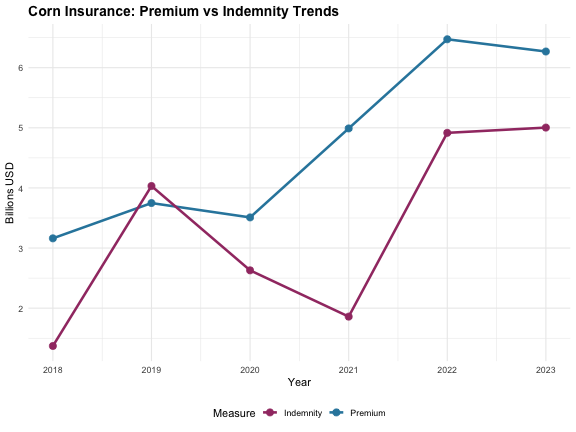

``` r
library(rfcip)
```

## Overview

The `rfcip` package provides tools to access publicly available data related to the Federal Crop Insurance Program (FCIP). The package functions as an unofficial API wrapper, making it easy to retrieve and analyze crop insurance data that is otherwise scattered across different URLs, files, and data portals.

**Important**: This package uses data provided by the USDA but is not endorsed by or affiliated with USDA or the Federal Government.

## Key Data Sources

### Summary of Business Data

The Summary of Business files contain comprehensive crop insurance participation and outcome data by state, county, crop, and insurance policy choices. This includes:

- Insured acres
- Collected premiums  
- Disbursed subsidies
- Liabilities
- Number of policies sold
- Number of indemnified policies
- Loss ratios

#### Basic Usage

Get current year data with default parameters:


``` r
# Get current year summary data
current_data <- get_sob_data()
head(current_data)
#> # A tibble: 6 × 21
#>   commodity_year policies_sold policies_earning_prem policies_indemnified
#>            <dbl>         <dbl>                 <dbl>                <dbl>
#> 1           2025          2514                  2069                  448
#> 2           2025       2525186               1220168               115193
#> 3           2025           806                     0                    0
#> 4           2025          3909                  3466                  368
#> 5           2025            16                    14                    0
#> 6           2025          2043                  2043                 1281
#> # ℹ 17 more variables: units_earning_prem <dbl>, units_indemnified <dbl>,
#> #   quantity <dbl>, quantity_type <chr>, companion_endorsed_acres <dbl>,
#> #   liabilities <dbl>, total_prem <dbl>, subsidy <dbl>, indemnity <dbl>,
#> #   efa_prem_discount <dbl>, addnl_subsidy <dbl>, state_subsidy <dbl>,
#> #   pccp_state_matching_amount <dbl>, organic_certified_subsidy_amount <dbl>,
#> #   organic_transitional_subsidy_amount <dbl>, earn_prem_rate <dbl>,
#> #   loss_ratio <dbl>
```

#### Filtering Data

Filter by specific criteria:


``` r
# Get corn data for 2022
corn_2022 <- get_sob_data(year = 2022, crop = "corn")
print(paste("Rows:", nrow(corn_2022)))
#> [1] "Rows: 1"

# Get data for multiple years and crops
multi_data <- get_sob_data(
  year = 2020:2022, 
  crop = c("corn", "soybeans"),
  state = "IA"
)
head(multi_data)
#> # A tibble: 6 × 25
#>   commodity_year commodity_code commodity_name state_code state_abbrv
#>            <dbl>          <int> <chr>               <dbl> <chr>      
#> 1           2020             41 Corn                   19 IA         
#> 2           2020             81 Soybeans               19 IA         
#> 3           2021             41 Corn                   19 IA         
#> 4           2021             81 Soybeans               19 IA         
#> 5           2022             41 Corn                   19 IA         
#> 6           2022             81 Soybeans               19 IA         
#> # ℹ 20 more variables: policies_sold <dbl>, policies_earning_prem <dbl>,
#> #   policies_indemnified <dbl>, units_earning_prem <dbl>,
#> #   units_indemnified <dbl>, quantity <dbl>, quantity_type <chr>,
#> #   companion_endorsed_acres <dbl>, liabilities <dbl>, total_prem <dbl>,
#> #   subsidy <dbl>, indemnity <dbl>, efa_prem_discount <dbl>,
#> #   addnl_subsidy <dbl>, state_subsidy <dbl>, pccp_state_matching_amount <dbl>,
#> #   organic_certified_subsidy_amount <dbl>, …
```

#### Discovering Available Options

Use helper functions to find valid parameter values:


``` r
# Get all available crops for 2024
crops_2024 <- get_crop_codes(2024)
head(crops_2024, 10)
#> # A tibble: 10 × 3
#>    commodity_year commodity_code commodity_name        
#>    <chr>          <chr>          <chr>                 
#>  1 2024           0107           Alfalfa Seed          
#>  2 2024           0211           All Other Citrus Trees
#>  3 2024           0028           Almonds               
#>  4 2024           0332           Annual Forage         
#>  5 2024           1191           Apiculture            
#>  6 2024           0184           Apple Trees           
#>  7 2024           0054           Apples                
#>  8 2024           0212           Avocado Trees         
#>  9 2024           0019           Avocados              
#> 10 2024           0255           Banana

# Get all available insurance plans
plans <- get_insurance_plan_codes(2024)
head(plans)
#> # A tibble: 6 × 4
#>   commodity_year insurance_plan_code insurance_plan         insurance_plan_abbrv
#>   <chr>          <chr>               <chr>                  <chr>               
#> 1 2024           90                  APH                    APH                 
#> 2 2024           91                  APH Price Component    APHPC               
#> 3 2024           43                  Aquaculture Dollar     AQDOL               
#> 4 2024           47                  Actual Revenue History ARH                 
#> 5 2024           05                  Area Revenue Protecti… ARP                 
#> 6 2024           06                  Area Revenue Protecti… ARP - HPE

# Check if a specific crop exists
corn_check <- get_crop_codes(2024, crop = "corn")
corn_check
#> # A tibble: 1 × 3
#>   commodity_year commodity_code commodity_name
#>   <chr>          <chr>          <chr>         
#> 1 2024           0041           Corn
```

### Detailed Data: Summary of Business by Type, Practice, and Unit Structure

For more granular data, use the SOBTPU version:


``` r
# Get detailed corn data for 2022 (large dataset, not evaluated in vignette)
detailed_data <- get_sob_data(
  year = 2022, 
  crop = "corn", 
  sob_version = "sobtpu"
)
head(detailed_data)
```

### Cause of Loss Data

Access indemnity data with associated causes of loss:


``` r
# Get cause of loss data for multiple years (large dataset, not evaluated in vignette)
col_data <- get_col_data(year = 2020:2022)
head(col_data)
```

### Price Data

Retrieve commodity price data used for insurance calculations:


``` r
# Get price data for corn in Illinois
price_data <- get_price_data(
  year = 2022:2023,
  crop = "corn", 
  state = "IL"
)
head(price_data)
#> # A tibble: 6 × 38
#>   CommodityYear CommodityCode CommodityName TypeCode TypeName       PracticeCode
#>           <int>         <int> <chr>            <int> <chr>                 <int>
#> 1          2022            41 Corn                16 High Amylose              2
#> 2          2022            41 Corn                16 High Amylose              3
#> 3          2022            41 Corn                17 All (Non-High…            2
#> 4          2022            41 Corn                17 All (Non-High…            3
#> 5          2023            41 Corn                16 High Amylose              2
#> 6          2023            41 Corn                16 High Amylose              3
#> # ℹ 32 more variables: PracticeName <chr>, StateCode <int>, StateName <chr>,
#> #   PriceMultiplicativeFactor <dbl>, PriceAdditiveFactor <dbl>,
#> #   ProjectedPriceExchangeCode <chr>, ProjectedPriceMarketSymbolCode <chr>,
#> #   ProjectedPricePreviousMarketSymbolCode <chr>,
#> #   ProjectedPriceCurrencyMarketSymbolCode <lgl>,
#> #   ProjectedPriceBeginDate <dttm>, ProjectedPriceEndDate <dttm>,
#> #   ProjectedPriceDateRange <chr>, ProjectedPrice <dbl>, …
```

### Livestock Data

Access livestock and dairy participation data:


``` r
# Get Livestock Risk Protection data
lrp_data <- get_livestock_data(year = 2020:2022, program = "LRP")

# Get Dairy Revenue Protection data  
drp_data <- get_livestock_data(year = 2020:2022, program = "DRP")

# Get Livestock Gross Margin data
lgm_data <- get_livestock_data(year = 2020:2022, program = "LGM")
```

## Working with the Data

### Data Aggregation Levels

Control aggregation using the `group_by` parameter:


``` r
# National level (default)
national <- get_sob_data(year = 2022, crop = "corn")
print(paste("National rows:", nrow(national)))
#> [1] "National rows: 1"

# County level detail
county_level <- get_sob_data(
  year = 2022, 
  crop = "corn", 
  group_by = "county"
)
print(paste("County level rows:", nrow(county_level)))
#> [1] "County level rows: 2405"

# Show first few counties with available columns
head(county_level[c("commodity_year", "total_prem", "indemnity")])
#> # A tibble: 6 × 3
#>   commodity_year total_prem indemnity
#>            <dbl>      <dbl>     <dbl>
#> 1           2022      46354    148839
#> 2           2022          0         0
#> 3           2022     159659    237761
#> 4           2022          0         0
#> 5           2022       2982         0
#> 6           2022          0         0
```

### Exporting Data

Export data directly to Excel:


``` r
# Export to Excel file (requires writexl package)
get_sob_data(
  year = 2022, 
  crop = "corn",
  dest_file = "corn_2022.xlsx"
)
```

## Performance Considerations

- Functions use memoization to cache results during R sessions
- For large datasets, consider filtering before downloading
- SOBTPU data requires full file downloads before filtering
- Progress bars show download status for long-running operations

## Static Datasets

The package includes pre-built datasets for reinsurance data:


``` r
# National Standard Reinsurance Agreement data
data(nationalSRA)
head(nationalSRA)
#> # A tibble: 6 × 11
#>   fund_abb reinsurance_year report_geography value_type            dollars
#>   <chr>               <dbl> <chr>            <chr>                   <dbl>
#> 1 AR                   1998 NationalFund     gross_liability    3286742595
#> 2 AR                   1998 NationalFund     gross_premium       313517141
#> 3 AR                   1998 NationalFund     gross_indemnity     463493075
#> 4 AR                   1998 NationalFund     retained_liability  597494229
#> 5 AR                   1998 NationalFund     retained_premium     58503706
#> 6 AR                   1998 NationalFund     retained_indemnity   51840753
#> # ℹ 6 more variables: data_release_month <dbl>, data_release_year <dbl>,
#> #   data_release_day <dbl>, data_release_date <date>, fund_name <chr>,
#> #   report_type <chr>
print(paste("National SRA years:", min(nationalSRA$year), "to", max(nationalSRA$year)))
#> [1] "National SRA years: Inf to -Inf"

# State-level SRA data
data(stateSRA)
print(paste("State SRA data includes", length(unique(stateSRA$state_name)), "states"))
#> [1] "State SRA data includes 0 states"

# National Livestock Price Reinsurance Agreement data
data(nationalLPRA)
print(paste("National LPRA years:", min(nationalLPRA$year), "to", max(nationalLPRA$year)))
#> [1] "National LPRA years: Inf to -Inf"
```

## Example Analysis

Here's a complete example analyzing corn insurance trends:


``` r
library(dplyr)
library(ggplot2)

# Get corn data for recent years
corn_trends <- get_sob_data(
  year = 2018:2023,  # Reduced range for faster processing
  crop = "corn"
) %>%
  select(commodity_year, total_prem, indemnity, loss_ratio) %>%
  mutate(
    total_prem = total_prem / 1e9,  # Convert to billions
    indemnity = indemnity / 1e9
  )

# Show the data
print("Corn trends data:")
#> [1] "Corn trends data:"
print(corn_trends)
#> # A tibble: 6 × 4
#>   commodity_year total_prem indemnity loss_ratio
#>            <dbl>      <dbl>     <dbl>      <dbl>
#> 1           2018       3.16      1.37      0.434
#> 2           2019       3.75      4.03      1.08 
#> 3           2020       3.51      2.63      0.749
#> 4           2021       4.99      1.86      0.373
#> 5           2022       6.47      4.92      0.760
#> 6           2023       6.27      5.00      0.798

# Plot premium vs indemnity trends
ggplot(corn_trends, aes(x = commodity_year)) +
  geom_line(aes(y = total_prem, color = "Premium"), size = 1.2) +
  geom_line(aes(y = indemnity, color = "Indemnity"), size = 1.2) +
  geom_point(aes(y = total_prem, color = "Premium"), size = 3) +
  geom_point(aes(y = indemnity, color = "Indemnity"), size = 3) +
  labs(
    title = "Corn Insurance: Premium vs Indemnity Trends",
    x = "Year",
    y = "Billions USD",
    color = "Measure"
  ) +
  theme_minimal() +
  theme(
    plot.title = element_text(size = 14, face = "bold"),
    legend.position = "bottom"
  ) +
  scale_color_manual(values = c("Premium" = "#2E86AB", "Indemnity" = "#A23B72"))
```



## Getting Help

- Use `help(function_name)` for detailed function documentation
- Check function examples with `example(function_name)`
- Report issues on GitHub: https://github.com/dylan-turner25/rfcip
- All data comes directly from USDA RMA sources - see function documentation for source URLs
