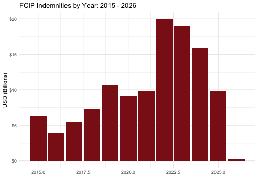

``` r
library(rfcip)
```

# Introduction
This vignette provides an introduction to the `rfcip` package which provides tools for accessing publicly available data related to the Federal Crop Insurance Program (FCIP). The package includes functions for accessing data from RMA's [Summary of Business](https://www.rma.usda.gov/tools-reports/summary-of-business) reports, [Cause of Loss](https://www.rma.usda.gov/tools-reports/summary-business/cause-loss) files, [Price Discovery](https://public-rma.fpac.usda.gov/apps/PriceDiscovery/) application, [Reinsurance Agreements](https://www.rma.usda.gov/tools-reports/reinsurance-reports), [Livestock and Dairy Participation](https://www.rma.usda.gov/tools-reports/summary-of-business/livestock-dairy-participation) reports, [Actuarial Data Master (ADM)](https://pubfs-rma.fpac.usda.gov/pub/References/actuarial_data_master/) datasets, and [Insurance Control Elements (ICE)](https://pubfs-rma.fpac.usda.gov/pub/References/insurance_control_elements/PASS/) data.

# Supported Data Sources

## Summary of Business
The [Summary of Business](https://www.rma.usda.gov/tools-reports/summary-of-business) files produced by the USDA Risk Management Agency contains crop insurance participation measures and outcomes by state, county, crop, and insurance policy choices. Insured acres, collected premiums, disbursed subsides, liabilities, number of policies sold, number of indemnified policies, and loss ratios are all available from the summary of business. 

Accessing data from the summary of business can be done using the `get_sob_data`. With no arguments specified, the `get_sob_data` function will default to downloading data from [RMA's summary of business report generator](https://public-rma.fpac.usda.gov/apps/SummaryOfBusiness/ReportGenerator) for the current year, at the highest level aggregation. 


``` r
library(rfcip)
get_sob_data()
#> # A tibble: 11 × 21
#>    commodity_year policies_sold policies_earning_prem policies_indemnified units_earning_prem units_indemnified quantity quantity_type companion_endorsed_a…¹
#>             <dbl>         <dbl>                 <dbl>                <dbl>              <dbl>             <dbl>    <dbl> <chr>                          <dbl>
#>  1           2025            82                    79                    0                126                 0  2.23e 7 Vines                              0
#>  2           2025         56927                 24174                 1042              82964              1042  5.30e 7 Head                               0
#>  3           2025            60                    28                    5                 84                15  2.77e 8 # of Clams                         0
#>  4           2025           795                   365                  251               4808               251  6.48e 7 Hundred Weig…                      0
#>  5           2025       2525240               1286019               126625            3160020            215877  5.57e 8 Acres                       85541494
#>  6           2025           812                     0                    0                  0                 0  0       Tons                               0
#>  7           2025          2514                  2069                  449               3834               709  5.12e 7 Trees                        7365741
#>  8           2025          3911                  3472                  375               5515               208  0       Not Reported                       0
#>  9           2025            16                    15                    0                 15                 0  1.92e 7 # of Shellfi…               12686500
#> 10           2025          7669                  6990                 5745              25913              9763  3.73e 6 Colonies                           0
#> 11           2025          2043                  2043                 1328              18210              4196  4.97e10 Pounds                             0
#> # ℹ abbreviated name: ¹​companion_endorsed_acres
#> # ℹ 12 more variables: liabilities <dbl>, total_prem <dbl>, subsidy <dbl>, indemnity <dbl>, efa_prem_discount <dbl>, addnl_subsidy <dbl>,
#> #   state_subsidy <dbl>, pccp_state_matching_amount <dbl>, organic_certified_subsidy_amount <dbl>, organic_transitional_subsidy_amount <dbl>,
#> #   earn_prem_rate <dbl>, loss_ratio <dbl>
```

Most of the arguments for the `get_sob_data` function filter the returned data. For example, specifying the `year = 2022` and `crop = "corn"` will return data for corn in crop year 2022. For a description of all the arguments that can be supplied to `get_sob_data` see the help file for the function using `help(get_sob_data)`

``` r
get_sob_data(year = 2022, crop = "corn")
#> # A tibble: 1 × 23
#>   commodity_year commodity_code commodity_name policies_sold policies_earning_prem policies_indemnified units_earning_prem units_indemnified quantity
#>            <dbl>          <int> <chr>                  <dbl>                 <dbl>                <dbl>              <dbl>             <dbl>    <dbl>
#> 1           2022             41 Corn                  590772                388010               106763             733238            184944 81513330
#> # ℹ 14 more variables: quantity_type <chr>, companion_endorsed_acres <dbl>, liabilities <dbl>, total_prem <dbl>, subsidy <dbl>, indemnity <dbl>,
#> #   efa_prem_discount <dbl>, addnl_subsidy <dbl>, state_subsidy <dbl>, pccp_state_matching_amount <dbl>, organic_certified_subsidy_amount <dbl>,
#> #   organic_transitional_subsidy_amount <dbl>, earn_prem_rate <dbl>, loss_ratio <dbl>
```
In the above example, the data set was filtered to a single crop, "corn". This potentially raises the question of what other values can be passed to the arguments that control the filters. For arguments with limited options, the options are explained in the functions help file (again, accessed via `help(get_sob_data)`). For some arguments that have many options, there are dedicated functions for pulling up values than can be passed to these arguments. 

The `get_crop_codes` function will return the commodity_code and commodity_name for a supplied year. Note that the `commodity_code` and `commodity_name` can be used interchangeably as values for the `crop` argument in `get_sob_data`. If there is a crop that is suspected to be an option, the `comm` argument can also be specified which will return just that specified crop if it exists. 

``` r
# get all crop codes and crop names for 2024
get_crop_codes(2024)
#> # A tibble: 129 × 3
#>    commodity_year commodity_code commodity_name        
#>    <chr>          <chr>          <chr>                 
#>  1 2024           0107           Alfalfa Seed          
#>  2 2024           0211           All Other Citrus Trees
#>  3 2024           0028           Almonds               
#>  4 2024           0332           Annual Forage         
#>  5 2024           1191           Apiculture            
#>  6 2024           0184           Apple Trees           
#>  7 2024           0054           Apples                
#>  8 2024           0212           Avocado Trees         
#>  9 2024           0019           Avocados              
#> 10 2024           0255           Banana                
#> # ℹ 119 more rows
```

``` r

# double check that "corn" is a valid crop
get_crop_codes(2024, crop = "corn")
#> # A tibble: 1 × 3
#>   commodity_year commodity_code commodity_name
#>   <chr>          <chr>          <chr>         
#> 1 2024           0041           Corn

# below are other ways to call the same data
get_crop_codes(2024, crop = "CORN")
#> # A tibble: 1 × 3
#>   commodity_year commodity_code commodity_name
#>   <chr>          <chr>          <chr>         
#> 1 2024           0041           Corn
get_crop_codes(2024, crop = 41)
#> # A tibble: 1 × 3
#>   commodity_year commodity_code commodity_name
#>   <chr>          <chr>          <chr>         
#> 1 2024           0041           Corn
```


The `get_insurance_plan_codes` function works analogously to the `get_crop_codes` function and helps identiy valid names of insurance plans. 

``` r
# return all insurance plans avaliable in 2024
get_insurance_plan_codes(year = 2024)
#> # A tibble: 35 × 4
#>    commodity_year insurance_plan_code insurance_plan                                    insurance_plan_abbrv
#>    <chr>          <chr>               <chr>                                             <chr>               
#>  1 2024           90                  APH                                               APH                 
#>  2 2024           91                  APH Price Component                               APHPC               
#>  3 2024           43                  Aquaculture Dollar                                AQDOL               
#>  4 2024           47                  Actual Revenue History                            ARH                 
#>  5 2024           05                  Area Revenue Protection                           ARP                 
#>  6 2024           06                  Area Revenue Protection - Harvest Price Exclusion ARP - HPE           
#>  7 2024           04                  Area Yield Protection                             AYP                 
#>  8 2024           50                  Dollar Amount Of Insurance                        DO                  
#>  9 2024           83                  Dairy Revenue Protection                          DRP                 
#> 10 2024           88                  Enhanced Cov Opt - Rev Prot                       ECO-RP              
#> # ℹ 25 more rows

# return the insurance plan code for the revenue projection plan
get_insurance_plan_codes(year = 2024, plan = "revenue protection")
#> # A tibble: 1 × 4
#>   commodity_year insurance_plan_code insurance_plan     insurance_plan_abbrv
#>   <chr>          <chr>               <chr>              <chr>               
#> 1 2024           02                  Revenue Protection RP

# below are other ways to call the same data
get_insurance_plan_codes(year = 2024, plan = 2)
#> # A tibble: 1 × 4
#>   commodity_year insurance_plan_code insurance_plan     insurance_plan_abbrv
#>   <chr>          <chr>               <chr>              <chr>               
#> 1 2024           02                  Revenue Protection RP
get_insurance_plan_codes(year = 2024, plan = "RP")
#> # A tibble: 1 × 4
#>   commodity_year insurance_plan_code insurance_plan     insurance_plan_abbrv
#>   <chr>          <chr>               <chr>              <chr>               
#> 1 2024           02                  Revenue Protection RP
get_insurance_plan_codes(year = 2024, plan = "reVeNue PrOtEcTiOn")
#> # A tibble: 1 × 4
#>   commodity_year insurance_plan_code insurance_plan     insurance_plan_abbrv
#>   <chr>          <chr>               <chr>              <chr>               
#> 1 2024           02                  Revenue Protection RP
```


As was previously stated above, most arguments for the `get_sob_data` function are for filtering the returned data. One exception is the `group_by` argument which does not filter the data being returned, but instead alters the level of aggregation. Taking the above example that returns data for corn in 2022 and setting `group_by = "county"` will return the same underlying as above, but decomposed by county. 

``` r
get_sob_data(year = 2022, crop = "corn", group_by = "county")
#> # A tibble: 2,405 × 27
#>    commodity_year commodity_code commodity_name       state_code state_abbrv county_code county_name policies_sold policies_earning_prem policies_indemnified
#>             <dbl>          <int> <chr>                <chr>      <chr>       <chr>       <chr>               <dbl>                 <dbl>                <dbl>
#>  1           2022           9999 All Other Commoditi… 01         AL          999         All Other …             2                     2                    1
#>  2           2022           9999 All Other Commoditi… 01         AL          007         Bibb                    6                     0                    0
#>  3           2022           9999 All Other Commoditi… 01         AL          013         Butler                 25                    14                    5
#>  4           2022           9999 All Other Commoditi… 01         AL          023         Choctaw                12                     0                    0
#>  5           2022           9999 All Other Commoditi… 01         AL          025         Clarke                  3                     1                    0
#>  6           2022           9999 All Other Commoditi… 01         AL          027         Clay                    1                     0                    0
#>  7           2022           9999 All Other Commoditi… 01         AL          029         Cleburne                6                     4                    0
#>  8           2022           9999 All Other Commoditi… 01         AL          057         Fayette                16                     7                    3
#>  9           2022           9999 All Other Commoditi… 01         AL          075         Lamar                  10                     3                    3
#> 10           2022           9999 All Other Commoditi… 01         AL          093         Marion                 16                     7                    2
#> # ℹ 2,395 more rows
#> # ℹ 17 more variables: units_earning_prem <dbl>, units_indemnified <dbl>, quantity <dbl>, quantity_type <chr>, companion_endorsed_acres <dbl>,
#> #   liabilities <dbl>, total_prem <dbl>, subsidy <dbl>, indemnity <dbl>, efa_prem_discount <dbl>, addnl_subsidy <dbl>, state_subsidy <dbl>,
#> #   pccp_state_matching_amount <dbl>, organic_certified_subsidy_amount <dbl>, organic_transitional_subsidy_amount <dbl>, earn_prem_rate <dbl>,
#> #   loss_ratio <dbl>
```

We can confirm `get_sob_data(year = 2022, crop = "corn")` and `get_sob_data(year = 2022, crop = "corn", group_by = "county")` return the same underlying data by summing up one of individual columns in the county level data. 

``` r
national_data <- get_sob_data(year = 2022, crop = "corn")
print(paste("Liabilities from national data: ",sum(national_data$liabilities)))
#> [1] "Liabilities from national data:  67671380320"

county_data <- get_sob_data(year = 2022, crop = "corn", group_by = "county")
print(paste("Liabilities from county data:   ",sum(county_data$liabilities)))
#> [1] "Liabilities from county data:    67671380320"
```


A unique property of the summary of business data set is that its continuously updated (one per week) as new information is reported to USDA by [approved insurance providers](https://cropinsuranceinamerica.org/who-are-approved-insurance-providers-aips/). This means that analysis using the summary of business can quickly become outdated. One advantage of the the `rfcip` package is that it allows the raw data source to be directly integrated into the analysis. For example, the chart below plots indemnities for each crop year from 2015 up to the current year. The plot will automatically update with the latest data every time the plot is regenerated. Note that functions in `rfcip` are [memoised](https://en.wikipedia.org/wiki/Memoization) for the duration of the R session. This means that calling the same function with the same arguments will return a previously cached data set. In other words, in the below example, the data would not update if the code was run multiple times in the same R session, regaurdless of if the underlying data source changed. 


``` r
library(rfcip)
library(dplyr)
library(ggplot2)

get_sob_data(year = 2015:as.numeric(format(Sys.Date(), "%Y"))) %>%
select(commodity_year, indemnity) %>%
group_by(commodity_year) %>%
summarize(indemnity = sum(indemnity)) %>%
mutate(indemnity = indemnity/1000000000) %>%
  ggplot(., aes(y = indemnity, x = commodity_year)) +
  geom_bar(stat = "identity", fill = "firebrick4") +
  xlab("") + ylab("USD (Billions)") +
  ggtitle(paste0("FCIP Indemnities by Year: 2015 - ",format(Sys.Date(), "%Y"))) +
  scale_y_continuous(labels = scales::dollar) +
  theme_minimal()
```



### Summary of Business by Type, Practice, and Unit Structure
The default behavior of the `get_sob_data()`function is to pull data from [RMA's summary of business report generator](https://public-rma.fpac.usda.gov/apps/SummaryOfBusiness/ReportGenerator). Although this allows for server side filtering of data before it gets to your local machine it does not allow access to the most granular version of the data know as the [Summary of Business by Type, Practice, and Unit Structure](https://www.rma.usda.gov/tools-reports/summary-of-business/state-county-crop-summary-business). By setting the optional parameter `sob_version = "sobtpu"` the behavior of the `get_sob_data()` function will change to pull data from the [Summary of Business by Type, Practice, and Unit Structure](https://www.rma.usda.gov/tools-reports/summary-of-business/state-county-crop-summary-business). Note that when `sob_version = "sobtpu"`, the arguments `delivery_type`, `comm_cat`, and `group_by` are not applicable and will be ignored. Otherwise, the function behaves the same as when `sob_version = "sob"` (the default). 


``` r
# get the summary of business by type, practice, and unit structure
data <- get_sob_data(year = 2022, crop = "corn", sob_version = "sobtpu")

head(data)
#>   commodity_year state_code state_name state_abbreviation county_code county_name commodity_code commodity_name insurance_plan_code
#> 1           2022          1    Alabama                 AL           1     Autauga             41           Corn                   1
#> 2           2022          1    Alabama                 AL           1     Autauga             41           Corn                   2
#> 3           2022          1    Alabama                 AL           1     Autauga             41           Corn                   2
#> 4           2022          1    Alabama                 AL           1     Autauga             41           Corn                   2
#> 5           2022          1    Alabama                 AL           1     Autauga             41           Corn                   2
#> 6           2022          1    Alabama                 AL           1     Autauga             41           Corn                   2
#>   insurance_plan_abbreviation coverage_type_code coverage_level_percent delivery_id type_code         type_name practice_code         practice_name
#> 1                          YP                  C                   0.50           R         0 No Type Specified             0 No Practice Specified
#> 2                          RP                  A                   0.60           R        16             Grain             3         Non-Irrigated
#> 3                          RP                  A                   0.65           R         0 No Type Specified             0 No Practice Specified
#> 4                          RP                  A                   0.70           R         0 No Type Specified             0 No Practice Specified
#> 5                          RP                  A                   0.70           R        16             Grain             2             Irrigated
#> 6                          RP                  A                   0.70           R        16             Grain             3         Non-Irrigated
#>   unit_structure_code unit_structure_name net_reporting_level_amount reporting_level_type liability_amount total_premium_amount subsidy_amount
#> 1                  OU       Optional Unit                          0                Acres                0                    0              0
#> 2                  BU          Basic Unit                         76                Acres            33327                 3520           2253
#> 3                  OU       Optional Unit                          0                Acres                0                    0              0
#> 4                  OU       Optional Unit                          0                Acres                0                    0              0
#> 5                  OU       Optional Unit                        355                Acres           319499                22646          13361
#> 6                  OU       Optional Unit                         51                Acres            21822                 4094           2416
#>   indemnity_amount loss_ratio endorsed_commodity_reporting_level_amount
#> 1                0       0.00                                         0
#> 2                0       0.00                                         0
#> 3                0       0.00                                         0
#> 4                0       0.00                                         0
#> 5            81213       3.59                                         0
#> 6            11644       2.84                                         0
```

Once consideration when using `sob_version = "sobtpu"` is that the data is only accessible via bulk download by year. This means there will be little to no performance advantage from filtering data via the function arguments since the full data set must be downloaded before the filters are applied. However, the function does apply the filters to each year-specific file as they are read in to minimize memory usage to the extent possible.


## Cause of Loss Files
Although RMA's [Summary of Business](https://www.rma.usda.gov/tools-reports/summary-of-business) files do report indemnities, they don't report the cause of loss associated with the indemnities which is often relevant. To obtain indemnities with the associated cause of loss that generated those indemnities, accessing the [cause of loss files](https://www.rma.usda.gov/tools-reports/summary-business/cause-loss) is necessary. Unlike data contained in the [summary of Business](https://www.rma.usda.gov/tools-reports/summary-of-business), the [cause of loss files](https://www.rma.usda.gov/tools-reports/summary-business/cause-loss) can only be accessed by bulk downloading all data for a particular year. Because of this, the cause of loss data cannot be filtered prior to loading it into local memory meaning there is no advantage to offering any within-function filtering options. To download [cause of loss files](https://www.rma.usda.gov/tools-reports/summary-business/cause-loss) for a year or series of years, use the `get_col_data` function. The function will automatically download all the relevant cause of loss files and merge them into a single data frame that will be returned. 


``` r
col_data <- get_col_data(year = 2020:2022)
head(col_data)
#>   commodity_year state_code state_abbrv county_code county_name commodity_code commodity_name insurance_plan_code insurance_plan_abbrv delivery_type
#> 1           2020          1          AL           1     Autauga             21         Cotton                   2                   RP             A
#> 2           2020          1          AL           1     Autauga             21         Cotton                   2                   RP             A
#> 3           2020          1          AL           1     Autauga             21         Cotton                   2                   RP             A
#> 4           2020          1          AL           1     Autauga             41           Corn                   2                   RP             A
#> 5           2020          1          AL           1     Autauga             41           Corn                   2                   RP             A
#> 6           2020          1          AL           1     Autauga             41           Corn                   2                   RP             A
#>   stage_code col_code                           col_name month_of_loss_code month_of_loss_name year_of_loss policies_earning_prem policies_indemnified
#> 1          H       31 Excess Moisture/Precipitation/Rain                  9                SEP         2020                     1                    1
#> 2          H       92      Hurricane/Tropical Depression                 10                OCT         2020                     3                    3
#> 3          H       92      Hurricane/Tropical Depression                  9                SEP         2020                     3                    3
#> 4          H        1                   Decline in Price                  9                SEP         2020                     1                    1
#> 5          H       11                            Drought                  7                JUL         2020                     1                    1
#> 6          R       93                           Wildlife                  5                MAY         2020                     1                    1
#>   net_planted_qty net_endorsed_acres  liability total_premium producer_paid_premium  subsidy state_subsidy addnl_subsidy efa_prem_discount
#> 1          38.925                  0  11519.000      1389.000               570.000   819.00             0             0                 0
#> 2         992.425                  0 495420.000     38585.500              8457.500 30128.00             0             0                 0
#> 3         392.600                  0 220061.000     17815.500              4157.500 13658.00             0             0                 0
#> 4          12.900                  0   2543.665       437.095               196.725   240.37             0             0                 0
#> 5           8.100                  0   1597.185       274.455               123.525   150.93             0             0                 0
#> 6          30.000                  0   5915.500      1016.500               457.500   559.00             0             0                 0
#>   indemnified_quantity indem_amount loss_ratio
#> 1               38.925      1938.00       1.40
#> 2              992.425     95015.00       2.46
#> 3              392.600     18962.00       1.06
#> 4               25.800      1602.18       3.67
#> 5               16.200      1006.02       3.67
#> 6               14.000       439.00       0.43
```


## Price
Insurance guarantees and indemnities for revenue protection plans are base, in part, on projected commodity prices and harvest commodity prices. These are available via RMA's [price discovery application](https://public-rma.fpac.usda.gov/apps/PriceDiscovery/), but can also be obtained using the `get_price_data` function which supports arguments for `year`, `crop`, and `state`. For example, prices for corn in Illinois from 2020-2024 can be obtained with the following code. 


``` r
price_data <- get_price_data(year = 2020:2024,
                             crop = "corn",
                             state = "IL")

head(price_data) 
#> # A tibble: 6 × 38
#>   CommodityYear CommodityCode CommodityName TypeCode TypeName        PracticeCode PracticeName StateCode StateName PriceMultiplicativeF…¹ PriceAdditiveFactor
#>           <int>         <int> <chr>            <int> <chr>                  <int> <chr>            <int> <chr>                      <dbl>               <dbl>
#> 1          2020            41 Corn                16 High Amylose               2 Conventional        17 Illinois                    1.4                    0
#> 2          2020            41 Corn                16 High Amylose               3 Organic             17 Illinois                    1.4                    0
#> 3          2020            41 Corn                17 All (Non-High …            2 Conventional        17 Illinois                    1                      0
#> 4          2020            41 Corn                17 All (Non-High …            3 Organic             17 Illinois                    2.23                   0
#> 5          2021            41 Corn                16 High Amylose               2 Conventional        17 Illinois                    1.4                    0
#> 6          2021            41 Corn                16 High Amylose               3 Organic             17 Illinois                    1.4                    0
#> # ℹ abbreviated name: ¹​PriceMultiplicativeFactor
#> # ℹ 27 more variables: ProjectedPriceExchangeCode <chr>, ProjectedPriceMarketSymbolCode <chr>, ProjectedPricePreviousMarketSymbolCode <chr>,
#> #   ProjectedPriceCurrencyMarketSymbolCode <lgl>, ProjectedPriceBeginDate <dttm>, ProjectedPriceEndDate <dttm>, ProjectedPriceDateRange <chr>,
#> #   ProjectedPrice <dbl>, ApprovedPriceVolatilityPercent <dbl>, HarvestPriceExchangeCode <chr>, HarvestPriceMarketSymbolCode <chr>,
#> #   HarvestPriceCurrencyMarketSymbolCode <lgl>, HarvestPriceBeginDate <dttm>, HarvestPriceEndDate <dttm>, HarvestPriceDateRange <chr>, HarvestPrice <dbl>,
#> #   HarvestPriceStatus <chr>, ProjectedSymbolCode <chr>, ProjectedSymbolName <chr>, ProjectedMonthCode <chr>, ProjectedMonthName <chr>, ProjectedYear <int>,
#> #   HarvestSymbolCode <chr>, HarvestMonthCode <chr>, HarvestMonthName <chr>, HarvestYear <int>, ProjectedPriceStatus <chr>
```

## Reinsurance Agreements

### Standard Reinsurance Agreement
Data related to the Standard Reinsurance Agreement (including retained liabilities, premiums, indemnities, and net underwriting gains and losses) is included as a static internal data set. To load the national level data set, use `data(nationalSRA)`. This data set is based on data from RMA's [reinsurance reports](https://www.rma.usda.gov/tools-reports/reinsurance-reports). 

``` r
# load the national SRA data set
data(nationalSRA)

head(nationalSRA)
#> # A tibble: 6 × 11
#>   fund_abb reinsurance_year report_geography value_type dollars data_release_month data_release_year data_release_day data_release_date fund_name report_type
#>   <chr>               <dbl> <chr>            <chr>        <dbl>              <dbl>             <dbl>            <dbl> <date>            <chr>     <chr>      
#> 1 AR                   1998 NationalFund     gross_lia…  3.29e9                  2              2002                9 2002-02-09        Assigned… Standard R…
#> 2 AR                   1998 NationalFund     gross_pre…  3.14e8                  2              2002                9 2002-02-09        Assigned… Standard R…
#> 3 AR                   1998 NationalFund     gross_ind…  4.63e8                  2              2002                9 2002-02-09        Assigned… Standard R…
#> 4 AR                   1998 NationalFund     retained_…  5.97e8                  2              2002                9 2002-02-09        Assigned… Standard R…
#> 5 AR                   1998 NationalFund     retained_…  5.85e7                  2              2002                9 2002-02-09        Assigned… Standard R…
#> 6 AR                   1998 NationalFund     retained_…  5.18e7                  2              2002                9 2002-02-09        Assigned… Standard R…

# pull up the data sets documentation file.
?nationalSRA

```

Similarly, a state level version of the SRA data set is also available. To load the state level data set, use `data(stateSRA)`.

``` r
# load the state SRA data set
data(stateSRA)

head(stateSRA)
#> # A tibble: 6 × 12
#>   state fund_abb reinsurance_year report_geography value_type       dollars data_release_month data_release_year data_release_day data_release_date fund_name
#>   <chr> <chr>               <int> <chr>            <chr>              <dbl>              <dbl>             <dbl>            <dbl> <date>            <chr>    
#> 1 AL    AR                   1998 StateFund        gross_liability   6.35e7                  2              2002                9 2002-02-09        Assigned…
#> 2 AL    AR                   1998 StateFund        gross_premium     7.15e6                  2              2002                9 2002-02-09        Assigned…
#> 3 AL    AR                   1998 StateFund        gross_indemnity   1.64e7                  2              2002                9 2002-02-09        Assigned…
#> 4 AL    AR                   1998 StateFund        retained_liabil…  1.27e7                  2              2002                9 2002-02-09        Assigned…
#> 5 AL    AR                   1998 StateFund        retained_premium  1.43e6                  2              2002                9 2002-02-09        Assigned…
#> 6 AL    AR                   1998 StateFund        retained_indemn…  1.51e6                  2              2002                9 2002-02-09        Assigned…
#> # ℹ 1 more variable: report_type <chr>

# pull up the data sets documentation file.
?stateSRA

```


### Livestock Price Reinsurance Agreement
Data related to the Livestock Price Reinsurance Agreement (including retained liabilities, premiums, indemnities, and net underwriting gains and losses) is included as a static internal data set. To load the national level data set, use `data(nationalLPRA)`. This data set is based on data from [reinsurance reports](https://www.rma.usda.gov/tools-reports/reinsurance-reports). 

``` r
# load the national SRA data set
data(nationalLPRA)

head(nationalLPRA)
#> # A tibble: 6 × 10
#>   reinsurance_year report_geography footnote           value_type dollars data_release_month data_release_year data_release_day data_release_date report_type
#>              <dbl> <chr>            <chr>              <chr>        <dbl>              <dbl>             <dbl>            <dbl> <date>            <chr>      
#> 1             2014 NationalFund     "Footnote: Amount… gross_lia…  1.04e9                 10              2018                1 2018-10-01        Livestock …
#> 2             2014 NationalFund     "Footnote: Amount… gross_pre…  2.28e7                 10              2018                1 2018-10-01        Livestock …
#> 3             2014 NationalFund     "Footnote: Amount… gross_ind…  1.05e7                 10              2018                1 2018-10-01        Livestock …
#> 4             2014 NationalFund     "Footnote: Amount… retained_…  4.03e8                 10              2018                1 2018-10-01        Livestock …
#> 5             2014 NationalFund     "Footnote: Amount… retained_…  8.64e6                 10              2018                1 2018-10-01        Livestock …
#> 6             2014 NationalFund     "Footnote: Amount… retained_…  3.69e6                 10              2018                1 2018-10-01        Livestock …

# pull up the data sets documentation file.
?nationalLPRA

```


Please note that `rfcip` is released with a [Contributor Code of Conduct](https://ropensci.org/code-of-conduct/#:~:text=rOpenSci%20is%20committed%20to%20providing,understand%E2%80%9D%20or%20%E2%80%9CWhy%E2%80%9D.). By contributing to the package you agree to abide by its terms.

## Livestock and Dairy Participation Reports
Some data on participation in livestock insurance plans can be retrieved using the `get_sob_data` function, however, more detailed information is available from the [Livestock and Dairy Participation](https://www.rma.usda.gov/tools-reports/summary-of-business/livestock-dairy-participation) reports. The `get_livestock_data` function can be used to download the most recent versions of the data contained there. 


``` r

# get data on the livestock risk protection plan from 2020 to 2022
lrp_data <- get_livestock_data(year = 2020:2022, program = "LRP")

# get data on the  dairy revenue protection plan from 2020 to 2022
drp_data <- get_livestock_data(year = 2020:2022, program = "DRP")

# get data on the livestock gross margin plan from 2020 to 2022
lgm_data <- get_livestock_data(year = 2020:2022, program = "LGM")

```
## Actuarial Data Master (ADM)

RMA's [Actuarial Data Master (ADM)](https://pubfs-rma.fpac.usda.gov/pub/References/actuarial_data_master/) contains the detailed actuarial data that underlies crop insurance rate-making and premium calculations. This data includes base rates, price discovery information, subsidy schedules, and reference information for all crops, counties, and insurance plans offered through the Federal Crop Insurance Program. Although publicly available, the data is difficult to access primarily due to the size of the raw files which overwhelms the memory on typical hardware. The `rfcip` package addresses this by pre-procssing the ADM data into smaller, more manageable data sets and applying compression techniques to reduce to total file size. The `get_adm_data()` function provides access to these processed ADM datasets which are stored as a [GitHub release](https://github.com/dylan-turner25/rfcip/releases).


``` r
library(rfcip)

# Get base rate data for 2020
baserate_2020 <- get_adm_data(year = 2020, dataset = "baserate")

# Get price data for 2018
price_2018 <- get_adm_data(year = 2018, dataset = "price")

# Get subsidy data for multiple years
subsidy_multi <- get_adm_data(year = c(2018, 2019, 2020), dataset = "subsidypercent")
```

The function is case-insensitive for dataset names and can use either the descriptive name or the record code. All of the following return the same data:


``` r
# These all return the same BaseRate data for 2020
get_adm_data(year = 2020, dataset = "BaseRate")
get_adm_data(year = 2020, dataset = "base_RaTe")  
get_adm_data(year = 2020, dataset = "A01010")
get_adm_data(year = 2020, dataset = "a01010")
```

### Available Datasets

The package provides access to multiple ADM datasets across years 2011-2026. The datasets are organized into three categories:

#### Core Actuarial Datasets

- **BaseRate (A01010)**: Base rates for crop insurance premiums
- **Price (A00810)**: Commodity prices (established, projected, harvest)
- **SubsidyPercent (A00070)**: Premium subsidy percentages by coverage level
- **InsuranceOffer (A00030)**: Insurance offer information and coverage details
- **Beta (A01020)**: Beta risk adjustment factors for rate calculations
- **ComboRevenueFactor (A01030)**: Combined revenue factors for revenue insurance
- **CoverageLevelDifferential (A01040)**: Coverage level rate differentials
- **HistoricalRevenueCapping (A01110)**: Historical revenue capping data
- **HistoricalYieldTrend (A01115)**: Historical yield trend data (2016+)
- **AreaCoverageLevel (A01130)**: Area coverage levels (2017+)
- **AreaRate (A01135)**: Area rates for county-level coverage (2017+)
- **AreaRiskRate (A01005)**: Area risk rates (2011-2016)
- **UnitDiscount (A01090)**: Unit discount factors

#### Reference Datasets

- **Date (A00200)**: Important dates for crop insurance (sales closing, etc.)
- **Commodity (A00420)**: Commodity codes and descriptions
- **CommodityType (A00430)**: Commodity type classifications
- **County (A00440)**: County codes and names
- **InsurancePlan (A00460)**: Insurance plan codes and descriptions
- **IrrigationPractice (A00490)**: Irrigation practice codes
- **OrganicPractice (A00500)**: Organic practice designations
- **Practice (A00510)**: Practice codes and descriptions
- **State (A00520)**: State codes and names
- **Type (A00540)**: Crop type codes and descriptions

## Insurance Control Elements (ICE)
RMA's [Insurance Control Elements (ICE)](https://pubfs-rma.fpac.usda.gov/pub/References/insurance_control_elements/PASS/) data contains regulatory and administrative information used in the Federal Crop Insurance Program. This data includes legal descriptions, insurance plan details, commodity specifications, county information, and other control elements that define how crop insurance policies are structured and administered.

### Exploring Available Data
The ICE data repository contains hundreds of files organized by year and dataset type. To help users discover what data is available, the `get_ice_data()` function includes a metadata feature that returns information about available files without downloading them.


``` r
library(rfcip)
# Explore available ICE files for 2024
ice_meta_2024 <- get_ice_data(years = 2024, dataset = "metadata")
head(ice_meta_2024)
#>   year                                    filename                description size_bytes size_mb       date     time            datetime
#> 1 2024                        2024_D00001_CCWS.txt                   Ccws.txt     383534    0.37 08/18/2025 05:49 AM 2025-08-18 05:49:00
#> 2 2024                        2024_D00001_PASS.txt                   Pass.txt     866817    0.83 08/18/2025 05:49 AM 2025-08-18 05:49:00
#> 3 2024                         2024_D00001_ROE.txt                    Roe.txt      91508    0.09 08/18/2025 05:49 AM 2025-08-18 05:49:00
#> 4 2024           2024_D00002_ProcessResult_YTD.txt             Process Result        472    0.00 07/31/2023 06:05 AM 2023-07-31 06:05:00
#> 5 2024 2024_D00003_IceAddedCountyIndicator_YTD.txt Ice Added County Indicator        399    0.00 07/31/2023 06:05 AM 2023-07-31 06:05:00
#> 6 2024     2024_D00004_IceRelationshipType_YTD.txt      Ice Relationship Type        569    0.00 07/31/2023 06:05 AM 2023-07-31 06:05:00
#>                                                                                                                               url
#> 1                        https://pubfs-rma.fpac.usda.gov/pub/References/insurance_control_elements/PASS/2024/2024_D00001_CCWS.txt
#> 2                        https://pubfs-rma.fpac.usda.gov/pub/References/insurance_control_elements/PASS/2024/2024_D00001_PASS.txt
#> 3                         https://pubfs-rma.fpac.usda.gov/pub/References/insurance_control_elements/PASS/2024/2024_D00001_ROE.txt
#> 4           https://pubfs-rma.fpac.usda.gov/pub/References/insurance_control_elements/PASS/2024/2024_D00002_ProcessResult_YTD.txt
#> 5 https://pubfs-rma.fpac.usda.gov/pub/References/insurance_control_elements/PASS/2024/2024_D00003_IceAddedCountyIndicator_YTD.txt
#> 6     https://pubfs-rma.fpac.usda.gov/pub/References/insurance_control_elements/PASS/2024/2024_D00004_IceRelationshipType_YTD.txt
```

The metadata shows file names, descriptions, sizes, and last update dates, making it easy to identify relevant datasets before committing to downloads.

### Accessing ICE Data
Once you've identified the datasets of interest, you can download them by specifying filter keywords in the `dataset` parameter. The function will download all files matching your criteria and combine them into a single data frame.


``` r
# Get legal description data for 2024
legal_data <- get_ice_data(years = 2024, dataset = "LegalDescription")
head(legal_data)
#> # A tibble: 6 × 9
#>   record_type_code state_code county_code legal_description township_range frst_divid           released_date last_released_date deleted_date
#>   <chr>            <chr>      <chr>       <chr>             <chr>          <chr>                <date>        <date>             <lgl>       
#> 1 D00062           01         001         0001-015N-012E    015N-012E      AL250150N0120E0SN010 2025-08-07    2025-06-12         NA          
#> 2 D00062           01         001         0001-016N-012E    016N-012E      AL250160N0120E0SN010 2025-08-07    2025-06-12         NA          
#> 3 D00062           01         001         0001-016N-013E    016N-013E      AL250160N0130E0SN010 2025-08-07    2025-06-12         NA          
#> 4 D00062           01         001         0001-016N-014E    016N-014E      AL250160N0140E0SN010 2025-08-07    2025-06-12         NA          
#> 5 D00062           01         001         0001-016N-015E    016N-015E      AL250160N0150E0SN010 2025-08-07    2025-06-12         NA          
#> 6 D00062           01         001         0001-017N-012E    017N-012E      AL250170N0120E0SN010 2025-08-07    2025-06-12         NA
```

### Filtering by Dataset Type
The `dataset` parameter accepts keywords that are matched against filenames. This allows you to download specific types of data:


``` r
# Get insurance plan related data
plan_data <- get_ice_data(years = 2024, dataset = "InsurancePlan")

# You can also use dataset codes directly
d00007_data <- get_ice_data(years = 2024, dataset = "D00007")
```


# Caching and Performance

The `rfcip` package implements a caching system designed to minimizing redundant data downloads. This system combines session-level memoization with disk caching to provide performance benefits and reduce host server load.

## How Caching Works

### Two-Tier Caching System

1. **Session-Level Memoization**: All data functions are memoized using the `memoise` package, meaning that repeated calls with identical arguments within the same R session return cached results immediately without any disk I/O.

2. **Persistent Disk Caching**: Downloaded data is cached to disk in the package's installed location (view that location using `tools::R_user_dir("rfcip", "cache")` ). 

The caching system  handles partial data requests. For example, if you previously downloaded data for 2020-2022 and later request 2020-2023, the system will:
- Load 2020-2022 data from cache
- Only download the new 2023 data
- Combine both cached and fresh data in the returned data

Below is a demonstration of the performance increases that come from caching the data.

``` r
library(rfcip)

# First call - downloads and caches data (will take several seconds)
system.time({
  col_data1 <- get_col_data(year = 2020:2022)
})
#   user  system elapsed 
#  2.156   0.234  15.423 

# Subsequent call - loads from cache (much faster!)
system.time({
  col_data2 <- get_col_data(year = 2020:2022)
})
#   user  system elapsed 
#  0.023   0.008   0.156 

# Verify data is identical
identical(col_data1, col_data2)
# [1] TRUE
```

Since the above example already downloaded data for 2020 - 2022, the following only downloads 2023 data. 


``` r
# Request additional year - only downloads 2023, loads 2020-2022 from cache
col_data3 <- get_col_data(year = 2020:2023)

# The function automatically:
# 1. Identifies that 2020-2022 are already cached
# 2. Loads cached data for these years
# 3. Downloads only the missing 2023 data
# 4. Combines all data into a single data frame
```

Functions that utilize server-side data processing use the unique parameters of the function call to create unique cache entries. This means that different parameters will result in different cache entries. 


``` r
# These create separate cache entries due to different parameters
price_data_corn <- get_price_data(year = 2023, crop = "corn", state = "IL")
price_data_soy <- get_price_data(year = 2023, crop = "soybeans", state = "IL")
price_data_ia <- get_price_data(year = 2023, crop = "corn", state = "IA")
```

## Force Parameter and Cache Refresh

All caching functions include a `force` parameter for refreshing cached data.


``` r
# Force refresh - attempts fresh download, falls back to cache on failure
col_data_fresh <- get_col_data(year = 2020:2022, force = TRUE)

# If download fails due to network issues, you'll see:
# Warning: Download failed for year 2021, using cached data
```


## Cache Management

### Viewing Cache Information

Use `get_cache_info()` to inspect your cached data:


``` r
# View all cached files
cache_info <- get_cache_info()
print(cache_info)
#      filename size_mb            modified    function_type
# 1  col_2023.zip    45.2 2024-01-15 14:23:01     get_col_data
# 2  col_2022.zip    43.8 2024-01-15 14:22:45     get_col_data
# 3 price_abc123.parquet 2.1 2024-01-15 14:20:15  get_price_data
```

### Clearing Cache

Use `clear_rfcip_cache()` with various filtering options:


``` r
# Clear all cached data
clear_rfcip_cache()

# Clear only cause of loss data
clear_rfcip_cache(function_name = "get_col_data")

# Clear specific years
clear_rfcip_cache(years = c(2023, 2024))

# Clear livestock data for specific program
clear_rfcip_cache(function_name = "get_livestock_data", program = "LRP")
```


